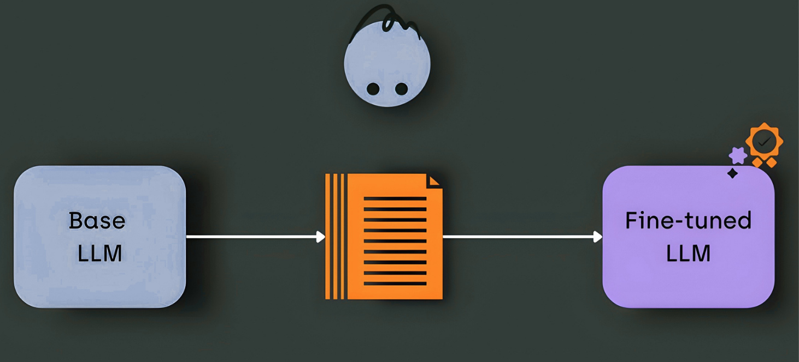

# NeuralChat — Local AI Interface

NeuralChat هي واجهة مستخدم (UI) بسيطة وأنيقة للتعامل مع نماذج الذكاء الاصطناعي المحلية (Local LLMs). المشروع مصمم بتركيز عالي على تجربة القراءة (Editorial Design) والخصوصية التامة، حيث يعتمد على **LM Studio** كـ Backend لتشغيل الموديلات محلياً.



## 🎨 Design Philosophy
المشروع مش مجرد شات؛ هو تجربة بصرية مريحة للعين:
- **Warm Ivory Palette:** استخدام ألوان دافئة لتقليل إجهاد العين (Zero eye strain).
- **Typography:** مزيج بين خطوط Serif للعناوين و Geometric للمحتوى لإعطاء طابع مطبوع (Editorial feel).
- **Performance:** واجهة خفيفة جداً مبنية بـ Vanilla JS و CSS مخصص.

## 🚀 Quick Start

### 1. المتطلبات
- تأكد من تشغيل **LM Studio** وتفعيل الـ Local Server على بورت `1234`.
- استخدم موديل يدعم الـ Chat (مثل `qwen2.5-coder` أو `llama3`).

### 2. تشغيل الـ Backend
قم بتنصيب المكتبات المطلوبة وتشغيل سيرفر الـ Flask:
```bash
pip install flask flask-cors langchain langchain-openai
python server.py
